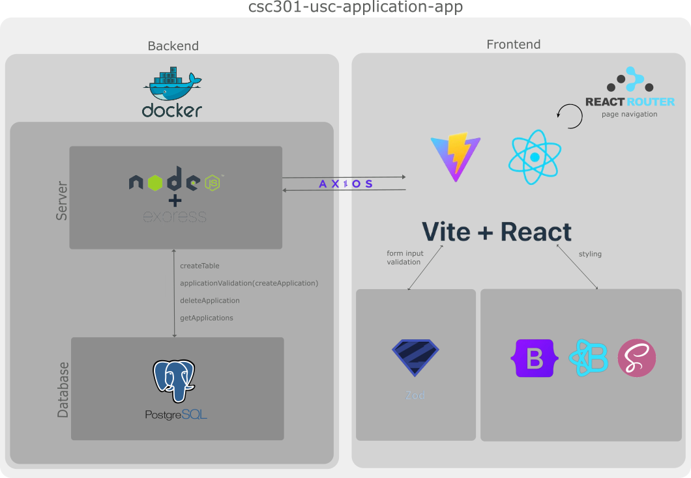
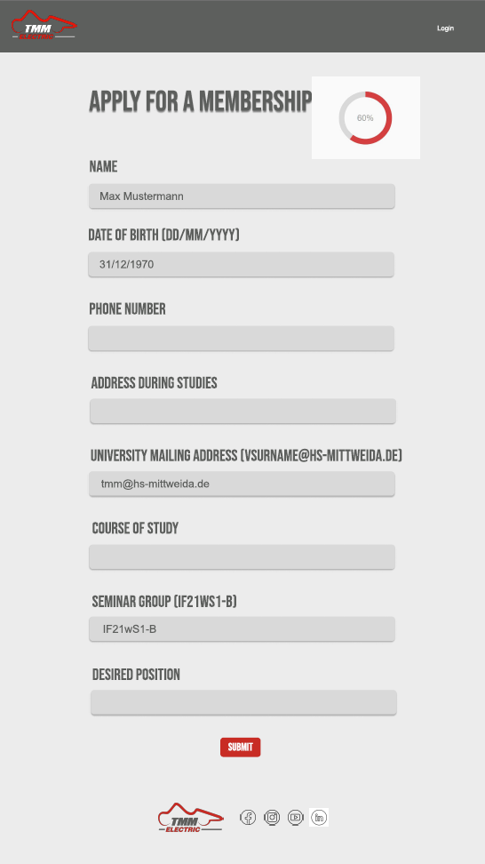
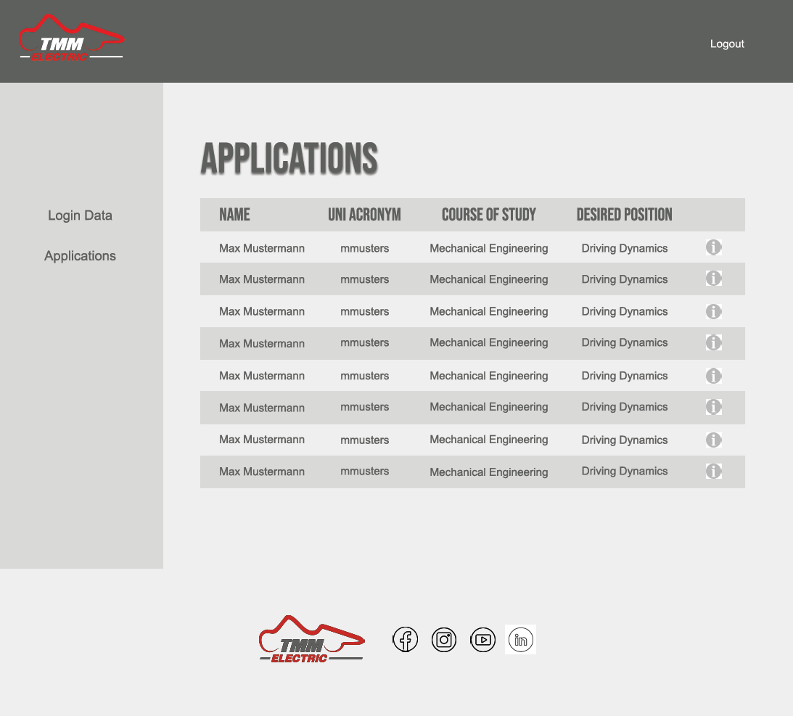

# csc301-assignment3

# Received Feedback
| Criteria | Pts | Comments | Improvements |
|----------|-----|----------|--------------|
| Framework, JavaScript, Build Tool | 12/13 | secure routing needs be handled for admin areas, good use of react features, great commenting, file and folder structure is good, good config in package.json file, data handled well within the app | |
| Node.js Server with Express.js | 6/9 | Integration is good, Nice separation of routes and functions, does not follow RESTful principles, post, delete and put could all have sat under the applications route as the http method would define the action against the applications | do not use verbs within url endpoints, it is recommended to use nouns and use the methods to describe what should happen to the resource (see below) |
| Database Integration and CRUD Operations | 3/3 | All CRUD operations used, Data is handled well, Good commenting | |
| Security Basics | 2.5/3 | CORS on the server found, good sanitisation and validation, environment variables being used appropriately, next time: look at headers through a library called helmet, frontend admin login can be easily bypassed by navigating directly to http://localhost:5174/intranet | library helmet for headers, prevent bypassing of login |
| Testing and Pipelines/Automation | 4/5 | .rest are not the best way to approach api testing (jest allows assertions against your responses which can be also run programmatically and further more allows for quality gates within deployment pipelines), great use of cypress, all tests had passed, thorough test cases | use jest |
| Code Quality and Documentation | 4/4 | great documentation, good code commenting, file and folder structure is clean, improvement: put images for the readme under a docs folder | put readme images inside docs folder |
| Project Functionality and Completeness | 3/3 | All features worked as expected without any major issues | |

## URL Endpoints Improvement
- current implementation of endpoints
    - GET /applications
    - POST /apply
    - DELETE /delete/application/:id
    - PUT /update/:id
- considering all operations are against the application ressource, the endpoints can be improved as follows:
    - GET /application
    - GET /application/:id
    - POST /application
    - DELETE /application/:id
    - PUT /application/:id
- the second implementation of endpoints allows developers to easily understand what the code is doing and against what ressource, without the need to know the context of the app

---

# About the App
This web app is intended to simplify the application process for the Formula Student Team "Technikum Mittweida Motorsprot" at the University of Applied Sciences Mittweida. For this purpose, a start page in the style of the newly created website is implemented, which redirects to an application form. From this page, the admin login data can be used to access the applications received.

# Use Web Application Locally
- prerequisites:
    - Node.js
    - Docker
- add `.env` files for both client and server
    - make sure that the `VITE_SERVER_API` defined port corresponds to the one defined in the server `.env` and that the port for the PostgreSQL database equals 5432
    - see Appendix 3 for `.env` file structure for both client and server
- start of client and server
    - install all dependencies in both folder by running `npm install`
    - start /client on localhost:[port]: `npm run dev`
    - start /server and database:
        - start Docker Daemon on your computer
        - run command `docker-compose up` to start dockerized containers
        - run command `docker-compose up --build` to build docker images and start dockerized containers at once
            - necessary when changes have been made to the Dockerfile or source code that affects the docker images

# Implementation


# Project Structure
The project is divided into two main folders, that represent the client and server. The client folder contains the react project, while the server folder contains the database and express server for database interaction. The most important files are described in the table below.

# Backend
The backend is completely dockerized, which means that both the database and the express server sits in their own docker container. This setup allows to isolate both environments, making it easier to manage, replicate, and deploy across different environments. Both containers are started using the command `docker-compose up`. With this command the docker containers are started based on the configurations defined in the `docker-compose.yaml` file. It uses the postgres docker image and the nodejs image of our express server which is defined in the Dockerfile of the project.

## Database
PostgreSQL is used as the database management system for the project. The initialization of the database as well as the CRUD operations are stored inside the `db.js` file. Once the server is started a database table `applications` with the columns id, name, birthdate, phonenumber, address, abbr, course, seminargroup and position is created. The database credentials of the PostgreSQL client are stored inside the `.env` file in the root of the project. The `.env` file is used to enable an effective and secure way to manage the environment variables. The [`dotenv` library](https://www.npmjs.com/package/dotenv) is used to load these. The `.env` file needs to be created the first time the project is started (see Appendix 3). Make sure to define the `DB_PORT` as 5432. All the CRUD (create, read, update, delete) operations are implemented, see Appendix 2.

## Server
The backend server is implemented using Express.js. This backend server provides endpoints to interact between the database and react app. It creates the table in case the table does not exist yet, when starting the server and defines four endpoints that link to the database CRUD operations create, readm update and delete that are defined inside the `db.js` file. Furthermore, the server performs a second validation of the application data. It uses the `express-validator` to perform the server-side validation. This validation is primarily based on the database definition. However, that is a little bit different for the passed birthdate. While the database needs a form of YYYY-MM-DD, the server validates to true if the birthdate corresponds to DD/MM/YYYY. That is because the birthdate will be formatted correctly before it is stored in the database. The server listens to the port that is defined inside the `.env` file of the backend.

# Frontend
The front end is build around the application form, which represents the main part of the project. The form enables the user to send data via the backend server to the PostgreSQL database to store their application and show it in the logged in version of the web page. To provide enough security and ensure that the input of the user complies with the expected format before it is submitted the npm package Zod is used to validate the input fields and display messages according to the occured errors. 

## Login
The login ensures that only those with the correct login data can access the received applications. However, it is not implemented for use on production, as it only compares the user input with the environment variables stored in the `.env` file of the client. This only provides one login access. Furthermore, it raises a security risk, as it is possible to bypass the login by accessing the internal website view by entering the corresponding URL /intranet.

## Design
The design approaches the styleguide of the team, which defines `Bebas Neue` and `Avenir Next` as the font familys to use. As the latter is subject to a fee, `Montserrat` was used as a similar font for this project. The colors used are also based on the team's style guide. The design prototypes of the web application are shown below. The final implementation differs slightly from these. The main reason for this that the final implementation facilitates the responsiveness of the web app.






# Output Validation
An automated Component Test will run using [Cypress and Github Action]((https://github.com/cypress-io/github-action/tree/master)) on push actions to ensure that the client-side validation works correctly. Run the command `npx cypres open` to run the component test manually inside your client folder. 

# Deployment
The web application has not been deployed because the application form for the Formula Student team should not be accessible on the internet until it is working correctly and is integrated.

---

# Appendices
## Appendix 1: Files of the Project

| Client/Server-Side | Folder     | File                   | Purpose                                                                                              |
|--------------------|------------|------------------------|------------------------------------------------------------------------------------------------------| 
| Client             | /          | index.html             | entry point of react project, references to main.jsx                                                 |
|                    | /          | main.jsx               | creates root and references App.jsx                                                                  |
|                    | /          | App.jsx                | contains link to components and renders them according to url using react router                     |
|                    | /          | .env                   | contains environmental variables of react project: server api and login credentials                  |
|                    | .github/workflows |                 | contains Github Actions                                                                              |
|                    | .github/workflows | main.yml        | starts cypress component test of ApplicationForm.jsx on push to Github repository                    |
|                    | cypress    |                        | testing                                                                                              |
|                    | cypress/component | applicationForm.jsx  | component testing of ApplicationForm.jsx                                                        |
|                    | public/images |                     | contains logos                                                                                       |
|                    | src/helper |                        | contains files that provide additional general function/knowledge for project                        |
|                    | src/helper | BackgroundChanger.jsx  | changes colors depending on the url                                                                  |
|                    | src/helper | converter.js           | contains function to convert data to correct/needed format                                           |
|                    | src/helper | positions.js           | contains dictionary of possible team positions to choose from                                        |
|                    | src/pages  |                        | contains react components                                                                            |
|                    | src/pages  | ApplicationForm.jsx    | displays application form, handles input field validation, error messages and post request to server |
|                    | src/pages  | Footer.jsx             | contains web page footer with logo and web links                                                     |
|                    | src/pages  | IntranetApplication.jsx| displays received applications and handles delete of applications                                    |
|                    | src/pages  | IntranetNavbar.jsx     | contains an additional navbar for the internal web page view below the general navbar                |
|                    | src/pages  | IntranetOverview.jsx   | only acts as "Landing Page" of the internal web page view                                            |
|                    | src/pages  | LandingPage.jsx        | entry point of web page (= start page), contains button to get to application form                   |
|                    | src/pages  | LoginModal.jsx         | modal with form to log into web page internal view                                                   |
|                    | src/pages  | Navigation.jsx         | contains web page navigation bar                                                                     |
|                    | src/scss   |                        | contains stylesheets                                                                                 |
|                    | src/scss   | _footer.scss           | contains footer styles                                                                               |
|                    | src/scss   | _form.scss             | contains form styles (general form styles, application form styles, login form styles)               |
|                    | src/scss   | _intranet.scss         | contains styles for internal web page view                                                           |
|                    | src/scss   | _navigation.scss       | contains navigation bar styles                                                                       |
|                    | src/scss   | _start.scss            | contains specific styles for start page                                                              |
|                    | src/scss   | _variables.scss        | contains variables (colors, social media buttons, box-shadow, fonts, layout) for the web page        |
|                    | src/scss   | custom.scss            | main stylesheet, import other custom stylesheets                                                     |
| Server             | /          | .env                   | contains environmental variables for server/database: database credentials, server port              |
|                    | /          | converter.js           | contains functions to convert request data to correct/needed format to store into database           |
|                    | /          | db.js                  | PostgreSQL database with CRUD operations (create, read, delete)                                      |
|                    | /          | docker-compose.yaml    | builds two docker containers                                                                         |
|                    | /          | Dockerfile             | docker image for backend application                                                                 |
|                    | /          | server.js              | backend nodejs express server that interacts with react app and postgreSQL db, includes server side validation |
|                    | /          | test.rest              | includes test requests                                                                                         |

## Appendix 2: CRUD Operations
| CRUD Operation    | Purpose | Action                                              | Usage in Web Application                                            |
|-------------------|---------|-----------------------------------------------------|---------------------------------------------------------------------|
| createApplication | create  | create a new application (includes formatting of data, so that the data can be stored in the database as desired) | ApplicationForm.jsx on submit event, that the user triggers when submitting the form |
| getApplications   | read    | get all stored applications from the database in ascending order based on the id | IntranetApplications.jsx to display received applications in application table of internal web page view |
| updateApplication | update  | update application with passed id in the database | IntranetApplications.jsx via button click to get into update form, update on submit of update form |
| deleteApplication | delete  | delete application with passed id from the database | IntranetApplications.jsx via button click in application table of internal web page view |

## Appendix 3: .env File Structure
/client/.env
```
VITE_SERVER_API=http://localhost:3003

VITE_ADMIN_LOGIN=
VITE_ADMIN_PWD=
```

/server/.env
```
DB_HOST=db
DB_USER=user123
DB_PORT=5432 # do not change, its the default port of PostgreSQL
DB_PASSWORD=password123
DB_NAME=db123

PORT=3003
```