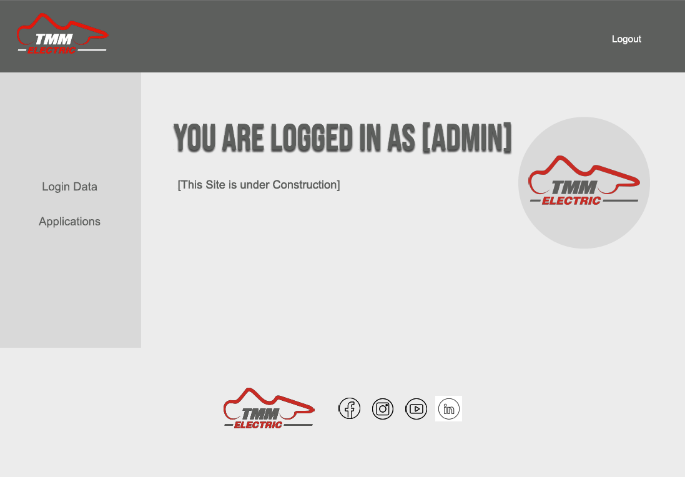

# csc301-assignment3

# About the App
This web app is intended to simplify the application process for the Formula Student Team "Technikum Mittweida Motorsprot" at the University of Applied Sciences Mittweida. For this purpose, a start page in the style of the newly created website is implemented, which redirects to an application form. From this page, the admin login data can be used to access the applications received.

# Use Web Application Locally
To use the web application locally, you need to start both client and server.

To do this, first, you will need to have Node.js as well as Docker installed. In addition to that the Node Package Manager (npm) and the Node Version Manager (nvm) is highly recommended to easily manage packages, dependencies and the current version of Node.js. The project uses Node.js v20.12.2, npm 10.5.0 and nvm 0.39.7. Check your current installed version with the following commands.
```
    node -v
    npm -v 
    nvm -v
```
After this make sure that you install the dependencies in both folders by running `npm install`.

Additionally, you will need to create two separate .env files: one for the client and one for the server. Both need to be created inside the root folder and be structured as follows:
/client/.env
```
VITE_SERVER_API=http://localhost:3003

VITE_ADMIN_LOGIN=
VITE_ADMIN_PWD=
```
/server/.env
```
DB_HOST=db
DB_USER=user123
DB_PORT=5432 # do not change, its the default port of PostgreSQL
DB_PASSWORD=password123
DB_NAME=db123

PORT=3003
```
The values for the environment variables can be different than the above. However, make sure that the `VITE_SERVER_API` defined port corresponds to the one defined in the server `.env` file and that the port for the PostgreSQL database equals 5432.

Once the prerequisites are installed, the web application can be used by starting the client and server. To start the client make sure that you are inside the client folder and type `npm run dev` inside your command line. This starts the application on localhost:[port].
To start the server as well as database make sure that you start the docker daemon on your computer. This allows to start the dockerized container by running the command `docker-compose up`. In case that you want to force a rebuild of the images before starting the container, run the command `docker-compose up --build`. That is necessary when changes have been made to the Dockerfile or source code that affects the image.

# Implementation


# Project Structure
The project is divided into two main folders, that represent the client and server. The client folder contains the react project, while the server folder contains the database and express server for database interaction. The most important files are described in the table below.

| Client/Server-Side | Folder     | File                   | Purpose                                                                                              |
|--------------------|------------|------------------------|------------------------------------------------------------------------------------------------------| 
| Client             | /          | index.html             | entry point of react project, references to main.jsx                                                 |
|                    | /          | main.jsx               | creates root and references App.jsx                                                                  |
|                    | /          | App.jsx                | contains link to components and renders them according to url using react router                     |
|                    | /          | .env                   | contains environmental variables of react project: server api and login credentials                  |
|                    | public/images |                     | contains logos                                                                                       |
|                    | src/helper |                        | contains files that provide additional general function/knowledge for project                        |
|                    | src/helper | BackgroundChanger.jsx  | changes colors depending on the url                                                                  |
|                    | src/helper | converter.js           | contains function to convert data to correct/needed format                                           |
|                    | src/helper | positions.js           | contains dictionary of possible team positions to choose from                                        |
|                    | src/pages  |                        | contains react components                                                                            |
|                    | src/pages  | ApplicationForm.jsx    | displays application form, handles input field validation, error messages and post request to server |
|                    | src/pages  | Footer.jsx             | contains web page footer with logo and web links                                                     |
|                    | src/pages  | IntranetApplication.jsx| displays received applications and handles delete of applications                                    |
|                    | src/pages  | IntranetNavbar.jsx     | contains an additional navbar for the internal web page view below the general navbar                |
|                    | src/pages  | IntranetOverview.jsx   | only acts as "Landing Page" of the internal web page view                                            |
|                    | src/pages  | LandingPage.jsx        | entry point of web page (= start page), contains button to get to application form                   |
|                    | src/pages  | LoginModal.jsx         | modal with form to log into web page internal view                                                   |
|                    | src/pages  | Navigation.jsx         | contains web page navigation bar                                                                     |
|                    | src/scss   |                        | contains stylesheets                                                                                 |
|                    | src/scss   | _footer.scss           | contains footer styles                                                                               |
|                    | src/scss   | _form.scss             | contains form styles (general form styles, application form styles, login form styles)               |
|                    | src/scss   | _intranet.scss         | contains styles for internal web page view                                                           |
|                    | src/scss   | _navigation.scss       | contains navigation bar styles                                                                       |
|                    | src/scss   | _start.scss            | contains specific styles for start page                                                              |
|                    | src/scss   | _variables.scss        | contains variables (colors, social media buttons, box-shadow, fonts, layout) for the web page        |
|                    | src/scss   | custom.scss            | main stylesheet, import other custom stylesheets                                                     |
| Server             | /          | .env                   | contains environmental variables for server/database: database credentials, server port              |
|                    | /          | converter.js           | contains functions to convert request data to correct/needed format to store into database           |
|                    | /          | db.js                  | PostgreSQL database with CRUD operations (create, read, delete)                                      |
|                    | /          | docker-compose.yaml    | builds two docker containers                                                                         |
|                    | /          | Dockerfile             | docker image for backend application                                                                 |
|                    | /          | server.js              | backend nodejs express server that interacts with react app and postgreSQL db, includes server side validation |
|                    | /          | test.rest              | includes test requests                                                                                         |

# Backend
The backend is completely dockerized, which means that both the database and the express server sits in their own docker container. This setup allows to isolate both environments, making it easier to manage, replicate, and deploy across different environments. Both containers are started using the command `docker-compose up`. With this command the docker containers are started based on the configurations defined in the `docker-compose.yaml` file. It uses the postgres docker image and the nodejs image of our express server which is defined in the Dockerfile of the project.

## Database
PostgreSQL is used as the database management system for the project. The initialization of the database as well as the CRUD operations are stored inside the `db.js` file. Once the server is started a database table `applications` with the columns id, name, birthdate, phonenumber, address, abbr, course, seminargroup and position is created. The database credentials of the PostgreSQL client are stored inside the `.env` file in the root of the project. The `.env` file is used to enable an effective and secure way to manage the environment variables. The [`dotenv` library](https://www.npmjs.com/package/dotenv) is used to load these. The `.env` file needs to be created the first time the project is started. The file has the following structure, that needs to be filled out. Make sure to define the `DB_PORT` as 5432 and feel free to take over the other values provided as example.
```
DB_HOST=db
DB_USER=user123
DB_PORT=5432 # do not change, its the default port of PostgreSQL
DB_PASSWORD=password123
DB_NAME=db123

PORT=3003
```
The following CRUD operations are implemented:

| CRUD Operation    | Action                                              | Usage in Web Application                                            |
|-------------------|-----------------------------------------------------|---------------------------------------------------------------------|
| getApplications   | get all stored applications from the database in ascending order based on the id | IntranetApplications.jsx to display received applications in application table of internal web page view |
| deleteApplication | delete application with passed id from the database | IntranetApplications.jsx via button click in application table of internal web page view |
| createApplication | create a new application (includes formatting of data, so that the data can be stored in the database as desired) | ApplicationForm.jsx on submit event, that the user triggers when submitting the form |

Consequently, there is no update operation implemented. This represents a further development step for the future.

## Server
The backend server is implemented using Express.js. This backend server provides endpoints to interact between the database and react app. It creates the table in case the table does not exist yet, when starting the server and defines three endpoints that link to the database operations create, read and delete that are defined inside the `db.js` file. Furthermore, the server performs a second validation of the data provided by the user via the application form in the react app. It uses the `express-validator` to perform this server-side validation. This validation is primarily based on the database definition. However, that is a little bit different for the passed birthdate. While the database needs a form of YYYY-MM-DD, the server validates to true if the birthdate corresponds to DD/MM/YYYY. That is because, the birthdate will be put in the right format inside the create operation of the database.
To reach the server, it listens to the port that is defined inside the `.env` file of the backend.

# Frontend
The front end is build around the application form, which represents the main part of the project. The form enables the user to send data via the backend server to the PostgreSQL database to store their application and show it in the logged in version of the web page. To provide enough security and ensure that the input of the user complies with the expected format, contraints, and business rules before it is submitted the npm package Zod is used to validate the input fields and display messages according to the occured errors. 

## Login
The login ensures that only those with the correct login data can access the received applications. However, it is not implemented for use on production, as it only compares the user input with the environment variables stored in the `.env` file of the client. This only provides one login access. Furthermore, it raises a security risk, as it is possible to bypass the login by accessing the internal website view by entering the corresponding URL.

## Design
The design approaches the styleguide of the team, which defines `Bebas Neue` and `Avenir Next` as the font familys to use. As the latter is subject to a fee, `Montserrat` was used as a similar font for this project. The colors used are also based on the team's style guide. The design prototypes of the web application are shown below. The final implementation differs slightly from these. The main reason for this that the final implementation facilitates the responsiveness of the web app.





# Output Validation
An automated Component Test will run using [Cypress and Github](https://github.com/cypress-io/github-action/tree/master) Action on push and pull request actions to ensure that the application form accepts the correct data. Run the command `npx cypres open` to run the component test manually inside your client folder. 

# Deployment
The web application has not been deployed because the application form for the Formula Student team should not be accessible on the internet until it is working correctly and is integrated.


     